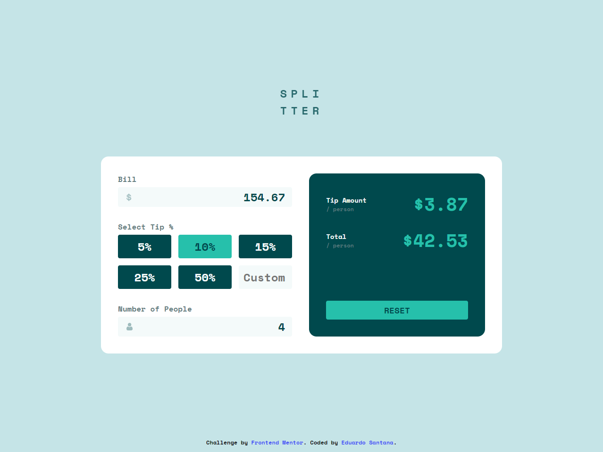
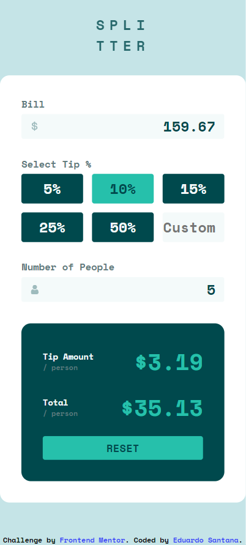

## Table of contents

- [Overview](#overview)
  - [The challenge](#the-challenge)
  - [Screenshot](#screenshot)
  - [Links](#links)
- [My process](#my-process)
  - [Built with](#built-with)
- [Author](#author)

## Overview

### The challenge

Users should be able to:

- View the optimal layout for the app depending on their device's screen size
- See hover states for all interactive elements on the page
- Calculate the correct tip and total cost of the bill per person

### Screenshot

### Links

- Solution URL: [Click to access the solution.](https://github.com/eduardosantanna/tip-calculator-app)
- Live Site URL: [Click to access the app.](https://eduardosantanna.github.io/tip-calculator-app/){:target="_blank"}

## My process

### Built with

- HTML5
- CSS custom properties
- Flexbox
- JavaScript

## Author

- Frontend Mentor - [@yourusername](https://www.frontendmentor.io/profile/yourusername)
